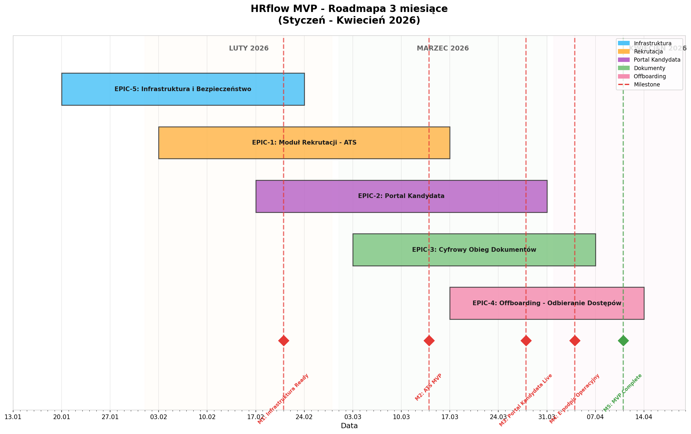

# HRflow - Roadmapa Projektu (MVP 3 miesiące)

## Oś Czasu Epików

**Okres planowania:** Styczeń 2026 - Kwiecień 2026 (12 tygodni)

---

## Wykres Gantta



---

## Harmonogram szczegółowy

### FAZA 1: Infrastruktura i Bezpieczeństwo

**EPIC-5** | Tydzień 1-5 (20.01 - 21.02.2026)

| Tydzień | Daty | Zakres prac |
|---------|------|-------------|
| T1 | 20-24.01.2026 | Setup projektu, repozytorium, CI/CD pipeline |
| T2 | 27-31.01.2026 | Baza danych PostgreSQL, autentykacja JWT |
| T3 | 03-07.02.2026 | RBAC, HTTPS/TLS, rate limiting |
| T4 | 10-14.02.2026 | Szyfrowanie AES-256, audit logging |
| T5 | 17-21.02.2026 | RODO (zgody, eksport, usunięcie), Redis, Elasticsearch |

**Deliverables:**

- ✅ Działający backend z autentykacją
- ✅ Bezpieczna infrastruktura zgodna z RODO
- ✅ Konteneryzacja Docker

---

### FAZA 2: Moduł Rekrutacji - ATS i Screening CV

**EPIC-1** | Tydzień 3-8 (03.02 - 14.03.2026)

| Tydzień | Daty | Zakres prac |
|---------|------|-------------|
| T3 | 03-07.02.2026 | Parsowanie CV (PDF/DOCX), ekstrakcja danych |
| T4 | 10-14.02.2026 | Scoring dopasowania, obsługa błędów plików |
| T5 | 17-21.02.2026 | Lista kandydatów z rankingiem |
| T6 | 24-28.02.2026 | Tworzenie i publikacja ofert pracy |
| T7 | 03-07.03.2026 | Filtrowanie, wyszukiwanie kandydatów |
| T8 | 10-14.03.2026 | Kanban rekrutacyjny, testy integracyjne |

**Deliverables:**

- ✅ Automatyczny screening CV z parsowaniem
- ✅ Scoring dopasowania kandydatów
- ✅ Panel rekrutera z zarządzaniem kandydatami

---

### FAZA 3: Portal Kandydata

**EPIC-2** | Tydzień 5-10 (17.02 - 28.03.2026)

| Tydzień | Daty | Zakres prac |
|---------|------|-------------|
| T5 | 17-21.02.2026 | Rejestracja i logowanie kandydata |
| T6 | 24-28.02.2026 | Profil kandydata, formularz aplikacji |
| T7 | 03-07.03.2026 | Dashboard "Moje aplikacje" z timeline |
| T8 | 10-14.03.2026 | Powiadomienia email + push |
| T9 | 17-21.03.2026 | Automatyczny feedback, przypomnienia |
| T10 | 24-28.03.2026 | Testy E2E, poprawki UX |

**Deliverables:**

- ✅ Portal kandydata z real-time tracking
- ✅ System powiadomień (email, push, in-app)
- ✅ Automatyczny feedback

---

### FAZA 4: Cyfrowy Obieg Dokumentów i E-podpis

**EPIC-3** | Tydzień 7-11 (03.03 - 04.04.2026)

| Tydzień | Daty | Zakres prac |
|---------|------|-------------|
| T7 | 03-07.03.2026 | Integracja z Autenti API |
| T8 | 10-14.03.2026 | Automatyczne generowanie umów z szablonów |
| T9 | 17-21.03.2026 | Podpisywanie elektroniczne, workflow |
| T10 | 24-28.03.2026 | Panel HR, archiwum dokumentów |
| T11 | 31.03-04.04.2026 | Przypomnienia, wygasanie linków |

**Deliverables:**

- ✅ E-podpis przez Autenti
- ✅ Generator umów z szablonów
- ✅ Archiwum cyfrowych dokumentów

---

### FAZA 5: Automatyczne Odbieranie Dostępów (Offboarding)

**EPIC-4** | Tydzień 9-12 (17.03 - 11.04.2026)

| Tydzień | Daty | Zakres prac |
|---------|------|-------------|
| T9 | 17-21.03.2026 | Integracja z Active Directory |
| T10 | 24-28.03.2026 | Automatyczna dezaktywacja kont (scheduler) |
| T11 | 31.03-04.04.2026 | Checklist offboardingu, przypisywanie zadań |
| T12 | 07-11.04.2026 | Exit interview, raporty, archiwizacja |

**Deliverables:**

- ✅ Automatyczne odbieranie dostępów AD/LDAP
- ✅ Checklist offboardingu z tracking
- ✅ Exit interview online

---

## Kamienie milowe (Milestones)

| Data | Milestone | Opis |
|------|-----------|------|
| **21.02.2026** | 🏁 M1: Infrastruktura Ready | Backend gotowy, autentykacja, bezpieczeństwo |
| **14.03.2026** | 🏁 M2: ATS MVP | Działający moduł rekrutacji ze screeningiem CV |
| **28.03.2026** | 🏁 M3: Portal Kandydata Live | Portal z trackingiem i powiadomieniami |
| **04.04.2026** | 🏁 M4: E-podpis Operacyjny | Cyfrowy obieg dokumentów z e-podpisem |
| **11.04.2026** | 🏁 M5: MVP Complete | Pełny offboarding, system gotowy do pilotażu |

---

## Zależności między Epikami

```
                    ┌─────────────────────────────────┐
                    │      🏗️  EPIC-5                 │
                    │  Infrastruktura i Bezpieczeństwo│
                    └───────────────┬─────────────────┘
                                    │
              ┌─────────────────────┼─────────────────────┐
              │                     │                     │
              ▼                     ▼                     ▼
┌─────────────────────┐  ┌─────────────────────┐  ┌─────────────────────┐
│    📋 EPIC-1        │  │    👤 EPIC-2        │  │    🚪 EPIC-4        │
│ Moduł Rekrutacji    │  │  Portal Kandydata   │  │    Offboarding      │
│       ATS           │  │                     │  │                     │
└──────────┬──────────┘  └─────────────────────┘  └─────────────────────┘
           │                       ▲
           │                       │
           └───────────────────────┤
                                   │
                    ┌──────────────┴──────────────┐
                    │       📝 EPIC-3             │
                    │ Cyfrowy Obieg Dokumentów    │
                    └─────────────────────────────┘
```

**Opis zależności:**

- **EPIC-5 → wszystkie** - Infrastruktura musi być gotowa przed rozpoczęciem innych modułów
- **EPIC-1 → EPIC-2** - Portal Kandydata wymaga działającego ATS (statusy, oferty)
- **EPIC-1 → EPIC-3** - Obieg dokumentów wymaga danych kandydatów z rekrutacji

---

## Alokacja zespołu

| Rola | Osoba | Główne Epiki |
|------|-------|--------------|
| Tech Lead | Adrian Jabłoński | EPIC-5, EPIC-4 |
| Backend Developer | Paweł Gorgolewski | EPIC-1, EPIC-3 |
| Frontend Developer | Kamil Pierzchała | EPIC-2 |
| Full-stack Developer | Łukasz Bartoszek | EPIC-1, EPIC-2 |
| DevOps/QA | Bartosz Balawender | EPIC-5, wszystkie testy |

---

## Ryzyka i mitygacje

| Ryzyko | Prawdopodobieństwo | Impact | Mitygacja |
|--------|-------------------|--------|-----------|
| Opóźnienie integracji Autenti | Średnie | Wysoki | Wczesne rozpoczęcie negocjacji, alternatywny provider (DocuSign) |
| Problemy z parsowaniem CV | Średnie | Średni | Zbiór testowy 50+ CV, fallback do manual review |
| Integracja AD w różnych środowiskach | Wysokie | Średni | Adapter pattern, środowisko testowe AD |
| Wydajność scoringu ML | Niskie | Średni | Cache Redis, async processing |

---

---

# Backlog Produktu - Szczegóły

## EPIC-1: Moduł Rekrutacji - ATS i Screening CV

**Cel:** Automatyzacja procesu rekrutacyjnego z inteligentnym screeningiem CV i zarządzaniem kandydatami. Skrócenie Time-to-Hire z 45 do 20 dni.

### Historyjki użytkownika

---

#### STORY-1: Parsowanie CV z ekstrakcją danych

| Pole | Wartość |
|------|---------|
| **Tytuł** | Parsowanie CV z ekstrakcją danych |
| **Priorytet** | High |
| **Story Points** | 8 |

**Opis wymagań:**
System automatycznie analizuje przesłane CV (PDF/DOCX), wydobywa kluczowe informacje: dane kontaktowe, doświadczenie zawodowe, umiejętności, wykształcenie. Kandydat może zobaczyć podgląd wyekstrahowanych danych i dokonać korekty.

**User Story:**
> Jako rekruter, chcę aby system automatycznie parsował CV kandydatów, abym nie musiał ręcznie przepisywać danych z dokumentów.

**Kryteria Akceptacji:**

- **Given:** Kandydat przesłał CV w formacie PDF zawierające sekcje: dane kontaktowe, doświadczenie, umiejętności, wykształcenie
- **When:** System przetwarza przesłany plik
- **Then:** W profilu kandydata zapisane są: imię, nazwisko, email, telefon, lista stanowisk z datami, lista umiejętności
- **And:** Czas parsowania nie przekracza 10 sekund
- **And:** Kandydat widzi podgląd wyekstrahowanych danych z możliwością korekty

**Refinement:**

- *Techniczny:* Implementacja parsera PDF/DOCX (biblioteka: PyMuPDF lub python-docx)
- *Techniczny:* Model NLP do ekstrakcji encji (NER) - rozważyć spaCy z modelem pl_core_news_lg
- *Techniczny:* API endpoint POST /api/v1/candidates/cv z obsługą multipart/form-data
- *Techniczny:* Walidacja formatów plików i limitów rozmiaru (max 5MB)
- *Organizacyjny:* Przygotować zestaw testowych CV (min. 50 dokumentów różnych formatów)
- *Organizacyjny:* Zdefiniować mapowanie pól CV na strukturę bazy danych

---

#### STORY-2: Scoring dopasowania kandydata do oferty

| Pole | Wartość |
|------|---------|
| **Tytuł** | Scoring dopasowania kandydata do oferty |
| **Priorytet** | High |
| **Story Points** | 5 |

**Opis wymagań:**
System oblicza score dopasowania (0-100%) kandydata do oferty na podstawie sparsowanego CV i wymagań oferty. Rozbicie na kategorie: umiejętności techniczne, doświadczenie, wykształcenie. Wizualizacja które wymagania kandydat spełnia.

**User Story:**
> Jako rekruter, chcę widzieć procentowe dopasowanie kandydata do oferty, abym mógł szybko priorytetyzować najlepszych kandydatów.

**Kryteria Akceptacji:**

- **Given:** CV kandydata zostało sparsowane, oferta ma zdefiniowane wymagane i opcjonalne kompetencje
- **When:** System oblicza dopasowanie kandydata
- **Then:** Kandydat otrzymuje score 0-100% z rozbiciem na kategorie
- **And:** Rekruter widzi wizualnie które wymagania kandydat spełnia, a których nie

**Refinement:**

- *Techniczny:* Algorytm scoringu z wagami dla różnych kategorii (konfigurowalny)
- *Techniczny:* Endpoint GET /api/v1/candidates/{id}/matching/{job_id}
- *Techniczny:* Cache scorów w Redis (TTL: 1h) dla wydajności
- *Organizacyjny:* Walidacja algorytmu z zespołem HR (warsztaty)

---

#### STORY-3: Obsługa nieobsługiwanych formatów CV

| Pole | Wartość |
|------|---------|
| **Tytuł** | Obsługa nieobsługiwanych formatów CV |
| **Priorytet** | Medium |
| **Story Points** | 3 |

---

#### STORY-4: Obsługa uszkodzonych plików CV

| Pole | Wartość |
|------|---------|
| **Tytuł** | Obsługa uszkodzonych plików CV |
| **Priorytet** | Medium |
| **Story Points** | 3 |

---

#### STORY-5: Lista kandydatów z rankingiem

| Pole | Wartość |
|------|---------|
| **Tytuł** | Lista kandydatów z rankingiem |
| **Priorytet** | High |
| **Story Points** | 5 |

---

#### STORY-6: Tworzenie i publikacja ofert pracy

| Pole | Wartość |
|------|---------|
| **Tytuł** | Tworzenie i publikacja ofert pracy |
| **Priorytet** | High |
| **Story Points** | 8 |

---

#### STORY-7: Filtrowanie i wyszukiwanie kandydatów

| Pole | Wartość |
|------|---------|
| **Tytuł** | Filtrowanie i wyszukiwanie kandydatów |
| **Priorytet** | Medium |
| **Story Points** | 5 |

---

#### STORY-8: Kanban rekrutacyjny (drag & drop statusów)

| Pole | Wartość |
|------|---------|
| **Tytuł** | Kanban rekrutacyjny (drag & drop statusów) |
| **Priorytet** | Medium |
| **Story Points** | 8 |

---

## EPIC-2: Portal Kandydata

**Cel:** Dedykowany portal dla kandydatów z real-time trackingiem statusu aplikacji i automatycznym feedbackiem. Osiągnięcie cNPS +50.

### Historyjki użytkownika

---

#### STORY-9: Dashboard moich aplikacji (kandydat)

| Pole | Wartość |
|------|---------|
| **Tytuł** | Dashboard moich aplikacji (kandydat) |
| **Priorytet** | High |
| **Story Points** | 8 |

**Opis wymagań:**
Portal dla kandydatów gdzie widzą wszystkie swoje aplikacje z aktualnym statusem. Timeline z historią zmian statusów i datami. Możliwość sortowania i filtrowania aplikacji.

**User Story:**
> Jako kandydat, chcę widzieć status wszystkich moich aplikacji w jednym miejscu, abym miał kontrolę nad procesami rekrutacyjnymi.

**Kryteria Akceptacji:**

- **Given:** Jestem zalogowanym kandydatem z 3 aktywnymi aplikacjami
- **When:** Otwieram sekcję 'Moje aplikacje'
- **Then:** Widzę listę wszystkich aplikacji z nazwą stanowiska, firmą, datą aplikacji i statusem
- **And:** Dla każdej aplikacji widzę timeline z historią zmian statusów i datami

**Refinement:**

- *Techniczny:* Endpoint GET /api/v1/candidates/me/applications z paginacją
- *Techniczny:* Model danych ApplicationStatusHistory z timestampami
- *Techniczny:* Frontend: React component z timeline visualization (np. react-vertical-timeline)
- *Techniczny:* WebSocket subscription dla real-time updates
- *Organizacyjny:* Design UI/UX dashboardu (mockupy w Figma)

---

#### STORY-10: Powiadomienia o zmianie statusu (email + push)

| Pole | Wartość |
|------|---------|
| **Tytuł** | Powiadomienia o zmianie statusu (email + push) |
| **Priorytet** | High |
| **Story Points** | 8 |

**Opis wymagań:**
System wysyła powiadomienia do kandydata przy każdej zmianie statusu aplikacji. Email w ciągu 5 minut, powiadomienie w portalu (czerwona kropka), opcjonalnie push notification na mobile.

**User Story:**
> Jako kandydat, chcę otrzymywać natychmiastowe powiadomienia o zmianach w moich aplikacjach, abym był na bieżąco bez konieczności ciągłego sprawdzania.

**Kryteria Akceptacji:**

- **Given:** Moja aplikacja zmieniła status z 'W ocenie' na 'Zaproszenie na rozmowę'
- **When:** Rekruter zapisuje zmianę statusu
- **Then:** Otrzymuję powiadomienie email w ciągu 5 minut
- **And:** Widzę powiadomienie w portalu (czerwona kropka przy dzwoneczku)
- **And:** Jeśli mam aplikację mobilną, dostaję push notification

**Refinement:**

- *Techniczny:* Event-driven architecture (Kafka/RabbitMQ) dla powiadomień
- *Techniczny:* Email service z szablonami (np. SendGrid, Mailgun)
- *Techniczny:* Push notifications via Firebase Cloud Messaging
- *Techniczny:* Notification preferences dla kandydata (opt-out opcje)
- *Techniczny:* Endpoint GET /api/v1/notifications z filtrami read/unread
- *Organizacyjny:* Przygotowanie szablonów emaili (copywriting)

---

#### STORY-11: Automatyczny feedback przy odrzuceniu

| Pole | Wartość |
|------|---------|
| **Tytuł** | Automatyczny feedback przy odrzuceniu |
| **Priorytet** | Medium |
| **Story Points** | 5 |

---

#### STORY-12: Przypomnienie o aplikacji bez zmian (14 dni)

| Pole | Wartość |
|------|---------|
| **Tytuł** | Przypomnienie o aplikacji bez zmian (14 dni) |
| **Priorytet** | Low |
| **Story Points** | 3 |

---

#### STORY-13: Rejestracja i logowanie kandydata

| Pole | Wartość |
|------|---------|
| **Tytuł** | Rejestracja i logowanie kandydata |
| **Priorytet** | High |
| **Story Points** | 5 |

---

#### STORY-14: Profil kandydata (edycja danych)

| Pole | Wartość |
|------|---------|
| **Tytuł** | Profil kandydata (edycja danych) |
| **Priorytet** | Medium |
| **Story Points** | 5 |

---

#### STORY-15: Formularz aplikacji na ofertę

| Pole | Wartość |
|------|---------|
| **Tytuł** | Formularz aplikacji na ofertę |
| **Priorytet** | High |
| **Story Points** | 5 |

---

## EPIC-3: Cyfrowy Obieg Dokumentów i E-podpis

**Cel:** Elektroniczny proces podpisywania dokumentów zatrudnienia bez drukowania i skanowania. Redukcja czasu pracy działu kadr o 80%.

### Historyjki użytkownika

---

#### STORY-16: Podpisanie umowy elektronicznie (e-podpis)

| Pole | Wartość |
|------|---------|
| **Tytuł** | Podpisanie umowy elektronicznie (e-podpis) |
| **Priorytet** | High |
| **Story Points** | 13 |

**Opis wymagań:**
Nowo zatrudniony pracownik otrzymuje pakiet dokumentów do podpisu elektronicznego. Po kliknięciu linku z emaila, przechodzi do dostawcy e-podpisu (Autenti), składa podpis i wraca do HRflow ze statusem 'Podpisane'. Otrzymuje email z podpisanymi dokumentami w PDF.

**User Story:**
> Jako nowo zatrudniony pracownik, chcę podpisać wszystkie dokumenty elektronicznie przed pierwszym dniem pracy, abym w pierwszy dzień mógł skupić się na poznawaniu zespołu.

**Kryteria Akceptacji:**

- **Given:** HR wysłał mi pakiet dokumentów do podpisu
- **When:** Otwieram link z emaila, loguję się, przeglądam dokumenty i klikam 'Podpisz'
- **Then:** System wysyła mnie do dostawcy e-podpisu (np. Autenti)
- **And:** Po złożeniu podpisu, wracam do HRflow gdzie widzę status 'Podpisane'
- **And:** Otrzymuję email z podpisanymi dokumentami w PDF

**Refinement:**

- *Techniczny:* Integracja z Autenti API (OAuth2, webhooks)
- *Techniczny:* Workflow engine dla procesu podpisywania (statusy: draft, sent, viewed, signed)
- *Techniczny:* Storage dla dokumentów (S3 + szyfrowanie AES-256)
- *Techniczny:* Endpoint POST /api/v1/documents/{id}/sign-request
- *Organizacyjny:* Negocjacja warunków z Autenti (pricing, SLA)
- *Organizacyjny:* Przygotowanie szablonów dokumentów (umowa o pracę, B2B, NDA)

---

#### STORY-17: Automatyczne generowanie umów z szablonu

| Pole | Wartość |
|------|---------|
| **Tytuł** | Automatyczne generowanie umów z szablonu |
| **Priorytet** | High |
| **Story Points** | 8 |

**Opis wymagań:**
HR Admin może wygenerować umowę automatycznie wypełnioną danymi kandydata (imię, nazwisko, stanowisko, wynagrodzenie, data rozpoczęcia) z predefiniowanego szablonu. Możliwość podglądu przed wysłaniem do podpisu.

**User Story:**
> Jako HR Admin, chcę generować umowy automatycznie z szablonów, abym nie musiał ręcznie wypełniać każdego dokumentu.

**Kryteria Akceptacji:**

- **Given:** Kandydat zaakceptował ofertę na stanowisko Senior Developer z wynagrodzeniem 20 000 PLN B2B
- **When:** Klikam 'Generuj umowę' i wybieram szablon 'Umowa B2B IT'
- **Then:** System automatycznie wypełnia szablon danymi: imię, nazwisko, stanowisko, wynagrodzenie, data rozpoczęcia
- **And:** Mogę przejrzeć dokument przed wysłaniem do podpisu
- **And:** Dokument jest zapisany w formacie pozwalającym na e-podpis

**Refinement:**

- *Techniczny:* Template engine (np. docxtpl dla Python, Handlebars dla Node.js)
- *Techniczny:* CRUD API dla szablonów: /api/v1/document-templates
- *Techniczny:* PDF conversion (LibreOffice headless lub Pandoc)
- *Techniczny:* Wersjonowanie szablonów
- *Organizacyjny:* Współpraca z działem prawnym przy tworzeniu szablonów

---

#### STORY-18: Przypomnienie o niepodpisanych dokumentach

| Pole | Wartość |
|------|---------|
| **Tytuł** | Przypomnienie o niepodpisanych dokumentach |
| **Priorytet** | Medium |
| **Story Points** | 3 |

---

#### STORY-19: Wygaśnięcie linku do podpisu (7 dni)

| Pole | Wartość |
|------|---------|
| **Tytuł** | Wygaśnięcie linku do podpisu (7 dni) |
| **Priorytet** | Low |
| **Story Points** | 2 |

---

#### STORY-20: Panel HR - zarządzanie dokumentami

| Pole | Wartość |
|------|---------|
| **Tytuł** | Panel HR - zarządzanie dokumentami |
| **Priorytet** | High |
| **Story Points** | 8 |

---

#### STORY-21: Archiwum podpisanych dokumentów

| Pole | Wartość |
|------|---------|
| **Tytuł** | Archiwum podpisanych dokumentów |
| **Priorytet** | Medium |
| **Story Points** | 5 |

---

## EPIC-4: Automatyczne Odbieranie Dostępów (Offboarding)

**Cel:** Automatyczna dezaktywacja dostępów do systemów IT przy zakończeniu zatrudnienia. 100% automatyzacja procesu odbierania dostępów.

### Historyjki użytkownika

---

#### STORY-22: Automatyczna dezaktywacja kont w dniu zakończenia

| Pole | Wartość |
|------|---------|
| **Tytuł** | Automatyczna dezaktywacja kont w dniu zakończenia |
| **Priorytet** | High |
| **Story Points** | 13 |

**Opis wymagań:**
W ostatnim dniu pracy pracownika (23:59) system automatycznie dezaktywuje: konto AD, email, VPN, dostępy do systemów wewnętrznych (Jira, Confluence, GitHub). IT Admin otrzymuje raport, menedżer powiadomienie.

**User Story:**
> Jako Administrator IT, chcę aby dostępy odchodzącego pracownika były automatycznie odbierane, abym nie musiał pamiętać o każdym systemie i nie ryzykować wycieku danych.

**Kryteria Akceptacji:**

- **Given:** Pracownik Jan Kowalski ma ostatni dzień pracy 31.01.2025
- **When:** Nastaje 31.01.2025, godzina 23:59
- **Then:** System automatycznie wyłącza konto AD, odbiera dostęp do email, dezaktywuje VPN, odbiera dostępy do systemów wewnętrznych
- **And:** IT Admin otrzymuje raport z listą odebranych dostępów
- **And:** Menedżer otrzymuje powiadomienie

**Refinement:**

- *Techniczny:* Integracja z Active Directory (LDAP/LDAPS) - biblioteka python-ldap lub ldap3
- *Techniczny:* Scheduler (Celery/APScheduler) dla automatycznych zadań o 23:59
- *Techniczny:* Adapter pattern dla różnych systemów (GitHub API, Jira API, VPN)
- *Techniczny:* Audit log wszystkich operacji dezaktywacji
- *Techniczny:* Rollback mechanism w przypadku błędów
- *Organizacyjny:* Mapowanie wszystkich systemów wymagających dezaktywacji
- *Organizacyjny:* Ustalenie SLA z IT na integracje

---

#### STORY-23: Lista kontrolna offboardingu (checklist)

| Pole | Wartość |
|------|---------|
| **Tytuł** | Lista kontrolna offboardingu (checklist) |
| **Priorytet** | High |
| **Story Points** | 8 |

**Opis wymagań:**
Przy rozpoczęciu offboardingu system generuje checklistę zadań: zwrot sprzętu, przekazanie obowiązków, exit interview, lista dostępów do odebrania. Możliwość przypisania zadań do odpowiednich osób z śledzeniem wykonania.

**User Story:**
> Jako HR Admin, chcę mieć checklistę offboardingu z przypisanymi zadaniami, abym miał pewność że nic nie zostanie pominięte.

**Kryteria Akceptacji:**

- **Given:** Pracownik złożył wypowiedzenie
- **When:** Rozpoczynam proces offboardingu
- **Then:** System generuje checklistę: zwrot sprzętu, przekazanie obowiązków, exit interview, dostępy do odebrania
- **And:** Mogę przypisać zadania do odpowiednich osób (IT, menedżer, HR)
- **And:** System śledzi wykonanie i przypomina o zaległych zadaniach

**Refinement:**

- *Techniczny:* Model OffboardingChecklist z relacją do OffboardingTask
- *Techniczny:* Konfigurowalne szablony checklist per stanowisko/dział
- *Techniczny:* Notifications engine dla przypomnień
- *Techniczny:* Dashboard z progress tracking
- *Organizacyjny:* Zdefiniowanie standardowej checklisty z HR i IT

---

#### STORY-24: Exit interview (ankieta online)

| Pole | Wartość |
|------|---------|
| **Tytuł** | Exit interview (ankieta online) |
| **Priorytet** | Medium |
| **Story Points** | 5 |

---

#### STORY-25: Raport offboardingu dla IT

| Pole | Wartość |
|------|---------|
| **Tytuł** | Raport offboardingu dla IT |
| **Priorytet** | Medium |
| **Story Points** | 3 |

---

#### STORY-26: Archiwizacja konta (nie usuwanie)

| Pole | Wartość |
|------|---------|
| **Tytuł** | Archiwizacja konta (nie usuwanie) |
| **Priorytet** | Medium |
| **Story Points** | 3 |

---

## EPIC-5: Infrastruktura i Bezpieczeństwo

**Cel:** Fundamenty techniczne systemu: autentykacja, autoryzacja, bezpieczeństwo RODO, infrastruktura.

### Zadania (Tasks)

| ID | Tytuł | Priorytet | Story Points |
|----|-------|-----------|--------------|
| TASK-1 | Setup projektu i repozytorium | High | 2 |
| TASK-2 | Konfiguracja CI/CD pipeline | High | 3 |
| TASK-3 | Setup bazy danych PostgreSQL | High | 2 |
| TASK-4 | Implementacja autentykacji JWT | High | 5 |
| TASK-5 | System ról i uprawnień (RBAC) | High | 5 |
| TASK-6 | Konfiguracja HTTPS/TLS 1.3 | High | 2 |
| TASK-7 | Implementacja rate limiting API | Medium | 3 |
| TASK-8 | Szyfrowanie danych w spoczynku (AES-256) | High | 3 |
| TASK-9 | Audit logging zdarzeń bezpieczeństwa | High | 5 |
| TASK-10 | Mechanizm zgód RODO | High | 5 |
| TASK-11 | Endpoint eksportu danych użytkownika | Medium | 3 |
| TASK-12 | Endpoint usunięcia danych (prawo do bycia zapomnianym) | Medium | 5 |
| TASK-13 | Konfiguracja Elasticsearch dla wyszukiwania | Medium | 5 |
| TASK-14 | Setup Redis dla cache | Medium | 2 |
| TASK-15 | Konteneryzacja Docker + docker-compose | High | 3 |
| TASK-16 | Monitoring i alerty (Prometheus + Grafana) | Medium | 5 |

---

## Podsumowanie backlogu

| Typ | Ilość | Story Points |
|-----|-------|--------------|
| Epiki | 5 | - |
| Historyjki (Stories) | 26 | 147 |
| Zadania (Tasks) | 16 | 55 |
| **RAZEM** | **47** | **202 SP** |

### Historyjki szczegółowe (z pełnymi opisami)

1. STORY-1: Parsowanie CV z ekstrakcją danych (8 SP)
2. STORY-2: Scoring dopasowania kandydata (5 SP)
3. STORY-9: Dashboard moich aplikacji (8 SP)
4. STORY-10: Powiadomienia o zmianie statusu (8 SP)
5. STORY-16: Podpisanie umowy elektronicznie (13 SP)
6. STORY-17: Automatyczne generowanie umów (8 SP)
7. STORY-22: Automatyczna dezaktywacja kont (13 SP)
8. STORY-23: Lista kontrolna offboardingu (8 SP)
